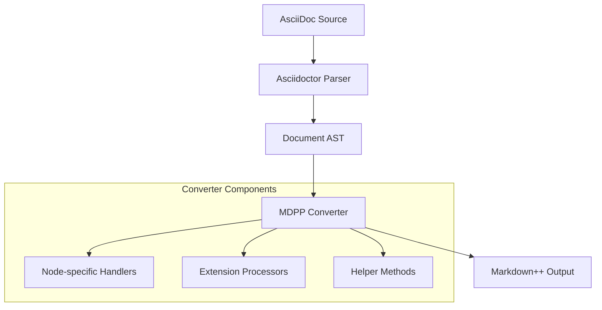
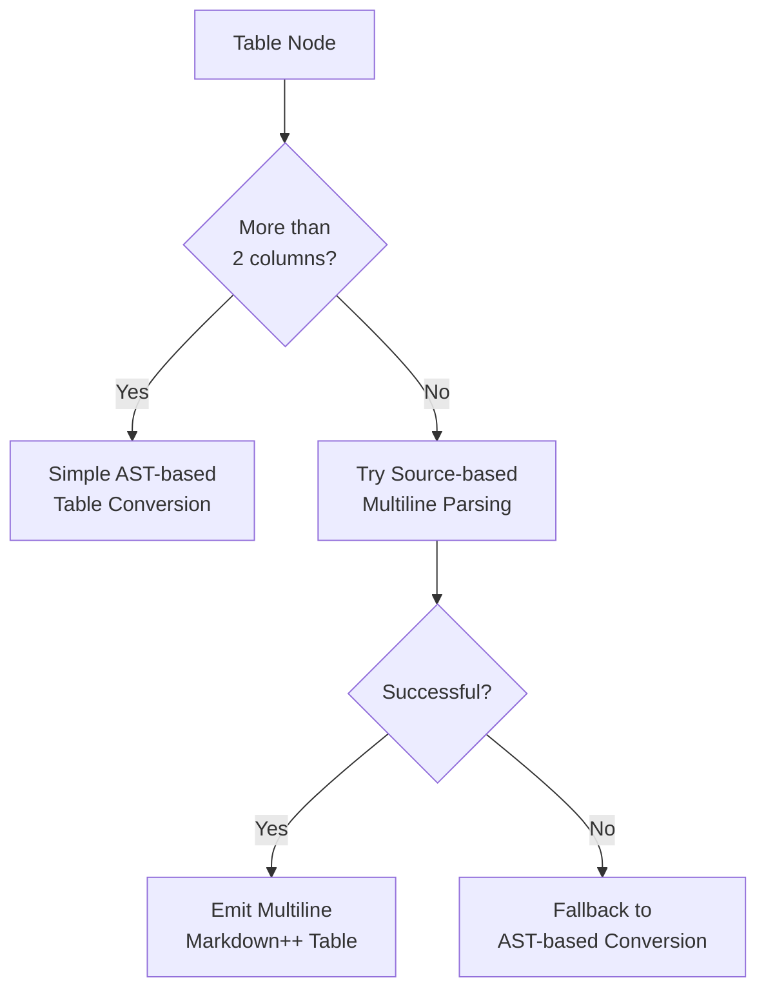
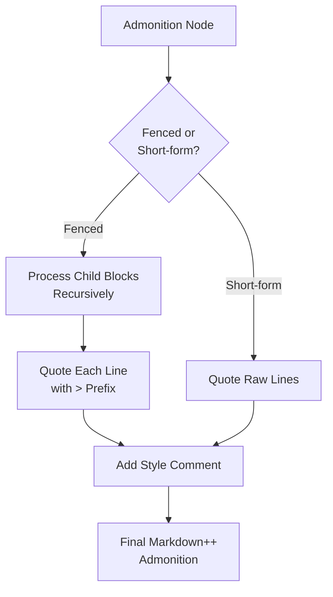

# System Patterns: Asciidoctor-MDPP

## Architecture Overview

The Asciidoctor-MDPP converter is built on Asciidoctor's extension framework, specifically its converter system. The architecture follows these key patterns:

## Key Components

### 1. Core Converter Class (MarkdownPPConverter)
- Registered for the 'mdpp' backend with `.md` file output
- Implements the primary `convert(node, transform)` method that dispatches to specific node converters
- Follows the Visitor Pattern where different node types are handled by dedicated methods

### 2. Node-Specific Handlers
- Specialized methods for each node type (e.g., `convert_paragraph`, `convert_section`, `convert_table`)
- Each handler is responsible for transforming a specific AsciiDoc node type to its Markdown++ equivalent
- Follow naming convention of `convert_[node_type]` (e.g., `convert_list_item`, `convert_admonition`)

### 3. Extensions
- Include processor to transform AsciiDoc includes into Markdown++ includes
- Extension system uses Asciidoctor's built-in extension mechanisms

## Processing Flow

1. Asciidoctor parses the AsciiDoc source into an Abstract Syntax Tree (AST)
2. The MDPP converter traverses the AST, starting with the root document node
3. For each node, the converter:
   - Determines the node type
   - Dispatches to the appropriate `convert_[node_type]` method
   - Processes the node's attributes and content
   - Recursively processes child nodes as needed
   - Returns the converted Markdown++ content
4. The final Markdown++ output is constructed by combining the results from all nodes

## Design Patterns

### Visitor Pattern
The converter implements a visitor pattern by:
- Defining a `convert` method that dispatches to specialized handlers
- Using node-specific conversion methods to handle each node type
- Traversing the document tree recursively

### Default Fallback Pattern
For unimplemented node types, the system:
- Uses a TODO comment as a fallback (`<!-- TODO: [node_type] -->`)
- Ensures graceful degradation for unsupported features
- Provides clear indicators of unconverted content

### AST Fallback Pattern
For complex structures like tables:
- First attempts to use source-based parsing for sophisticated rendering
- Falls back to AST-based rendering when source parsing fails
- Ensures consistent output even with malformed input

### Recursive Conversion
- Most container nodes recursively convert their children
- Node parent-child relationships are maintained during conversion
- Child blocks are joined with appropriate spacing based on context

## Critical Implementation Paths

### Table Conversion

### Admonition Conversion

### List Conversion
- Special handling for nested lists with proper indentation
- Distinct conversion paths for ordered and unordered lists
- Attempts to recover lost line breaks in list items through source location fallback

## Error Handling and Recovery

### Line Break Recovery
- Paragraph line breaks (trailing `+`) are handled by processing raw lines
- List-item breaks use a source location fallback mechanism
- Graceful degradation when recovery isn't possible

### AST Limitations Workarounds
- Source file lookups for multiline tables
- Custom parsing for retrieving information lost in the AST
- Fallbacks for scenarios where AST information is insufficient

## Testing Framework

The testing framework follows a fixtures-based approach:
- Sample AsciiDoc files in `spec/fixtures/samples/`
- Corresponding expected Markdown++ output in `spec/fixtures/expected/`
- Tests in `spec/converter_spec.rb` that validate conversion results
- Strict byte-for-byte comparison for test validation
